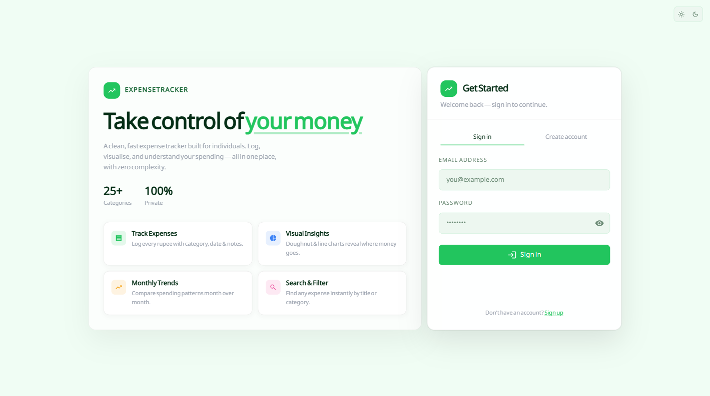
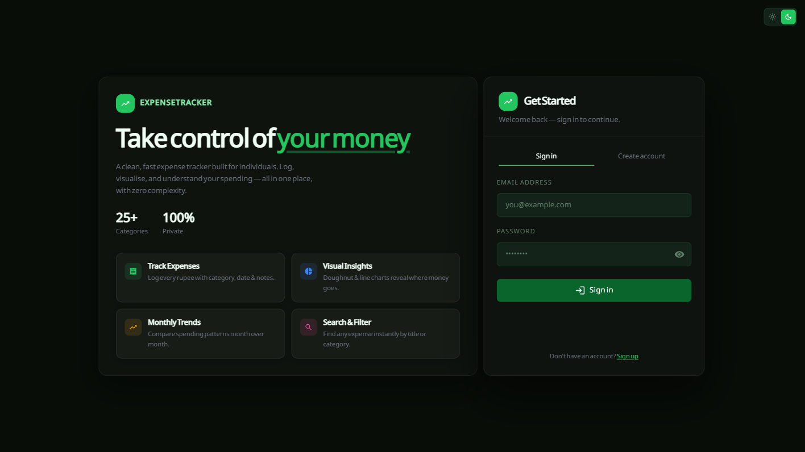
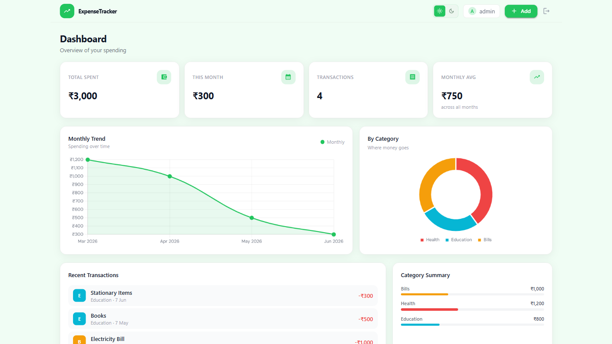
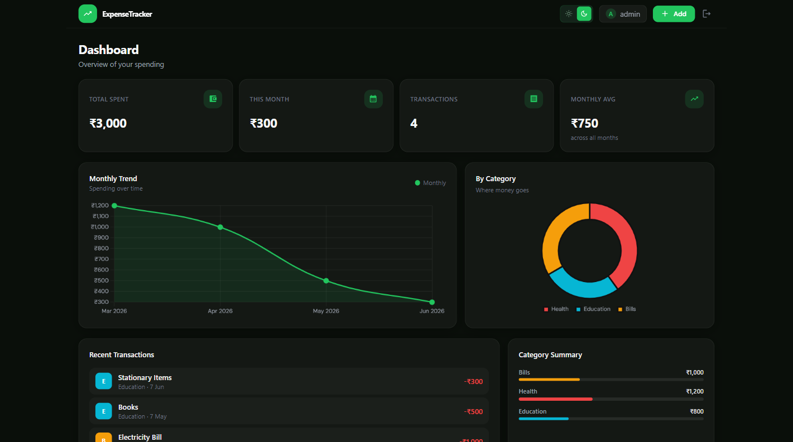
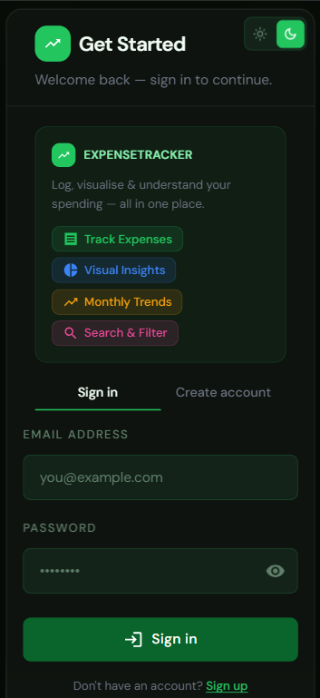
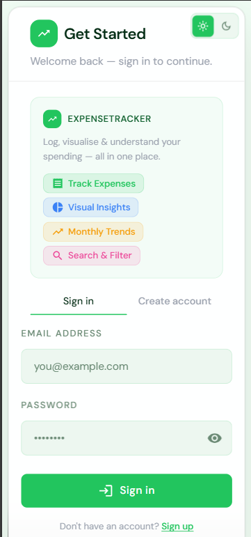
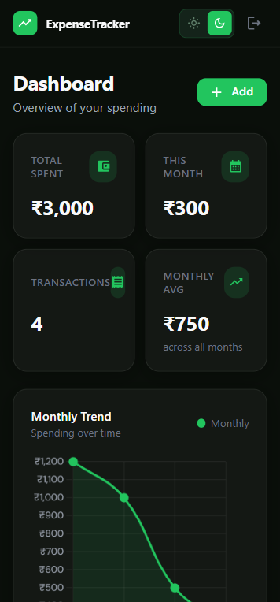
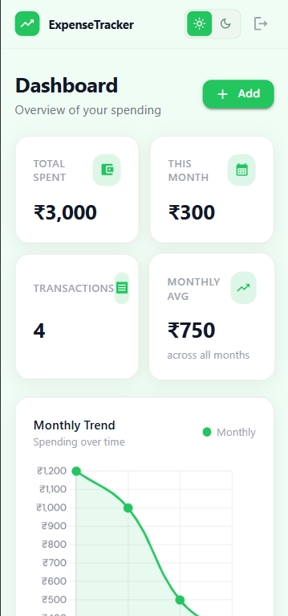

# EXPENSE TRACKER APP

React (Vite + TS + Tailwind + MUI) frontend with an Express + MongoDB backend.

## Demo Credentials

> **Quick Login — pre-filled with sample data**
>
> **Email:** `admin@gmail.com`
>
> **Password:** 123456
>
> Use these credentials to instantly explore the dashboard with real expense data or create a new account.
>
> 👉 [Open the app](https://expense-tracker-zeta-opal-56.vercel.app)

## Setup

### Backend

Create `.env` file in the backend root folder:

```
PORT=5000
MONGODB_URI=mongodb://localhost:27017/expense-tracker
JWT_SECRET=fdklfdjkfhwqifuesahfdjsalfoiwfdahldjsfhao
JWT_EXPIRES_IN=7d
NODE_ENV=development
```

Then run these commands:

```bash
cd backend
npm install
npm run dev                 # starts on :5000
```

### Frontend

Create `.env` file in the frontend root folder:

```
VITE_BACKEND_URL=http://localhost:5000/api
```

Then run these commands:

```bash
cd frontend
npm install
npm run dev                 # starts on :5173
```

---

## API Endpoints

### Auth

| Method | Path                 | Auth | Description        |
| ------ | -------------------- | ---- | ------------------ |
| POST   | `/api/auth/register` | ❌   | Register new user  |
| POST   | `/api/auth/login`    | ❌   | Login, returns JWT |
| GET    | `/api/health`        | ❌   | Health check       |

#### Register

`POST /api/auth/register`

Request body:

```json
{
  "name": "Jane Doe",
  "email": "jane@example.com",
  "password": "secret123"
}
```

#### Login

`POST /api/auth/login`

Request body:

```json
{
  "email": "jane@example.com",
  "password": "secret123"
}
```

---

### Expenses

All expense endpoints require a Bearer token in the `Authorization` header:

```
Authorization: Bearer <jwt>
```

| Method | Path                | Auth      | Description                             |
| ------ | ------------------- | --------- | --------------------------------------- |
| POST   | `/api/expenses`     | ✅ Bearer | Create a new expense                    |
| GET    | `/api/expenses`     | ✅ Bearer | Get all expenses for the logged-in user |
| GET    | `/api/expenses/:id` | ✅ Bearer | Get a single expense by ID              |
| PUT    | `/api/expenses/:id` | ✅ Bearer | Update an expense by ID                 |
| DELETE | `/api/expenses/:id` | ✅ Bearer | Delete an expense by ID                 |

---

#### Create Expense

`POST /api/expenses`

Request body:

```json
{
  "title": "Grocery Shopping",
  "amount": 1240,
  "category": "Food",
  "notes": "Weekly groceries from DMart",
  "expenseDate": "2025-06-01"
}
```

---

#### Get All Expenses

`GET /api/expenses`
Example request:

Response `200 OK`:

```json
{
  "expenses": [
    {
      "_id": "64f1a2b3c4d5e6f7a8b9c0d2",
      "userId": "64f1a2b3c4d5e6f7a8b9c0d1",
      "title": "Grocery Shopping",
      "amount": 1240,
      "category": "Food",
      "notes": "Weekly groceries from DMart",
      "expenseDate": "2025-06-01T00:00:00.000Z",
      "createdAt": "2025-06-01T10:30:00.000Z",
      "updatedAt": "2025-06-01T10:30:00.000Z"
    }
  ],
  "total": 1,
  "page": 1,
  "pages": 1
}
```

---

#### Get Single Expense

`GET /api/expenses/:id`

Example request:

```
GET /api/expenses/64f1a2b3c4d5e6f7a8b9c0d2
```

Response `200 OK`:

```json
{
  "_id": "64f1a2b3c4d5e6f7a8b9c0d2",
  "userId": "64f1a2b3c4d5e6f7a8b9c0d1",
  "title": "Grocery Shopping",
  "amount": 1240,
  "category": "Food",
  "notes": "Weekly groceries from DMart",
  "expenseDate": "2025-06-01T00:00:00.000Z",
  "createdAt": "2025-06-01T10:30:00.000Z",
  "updatedAt": "2025-06-01T10:30:00.000Z"
}
```

---

#### Update Expense

`PUT /api/expenses/:id`

All fields are optional — only send what you want to change.

Request body:

```json
{
  "title": "Grocery Shopping (updated)",
  "amount": 1350,
  "category": "Food",
  "notes": "Added extra items",
  "expenseDate": "2025-06-01"
}
```

---

#### Delete Expense

`DELETE /api/expenses/:id`

Example request:

```
DELETE /api/expenses/64f1a2b3c4d5e6f7a8b9c0d2
```

## Screenshots

### Login page

<p align="center">
  
</p>

<p align="center">
  
</p>

### Dashboard (Light Mode)

<p align="center">
  
</p>

<p align="center">
  
</p>

### Mobile Responsiveness

<p align="center">
  
  &nbsp;&nbsp;&nbsp;&nbsp;
  
</p>

<p align="center">
  
  &nbsp;&nbsp;&nbsp;&nbsp;
  
</p>
